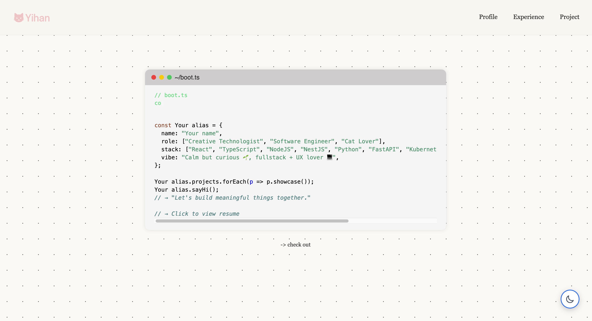
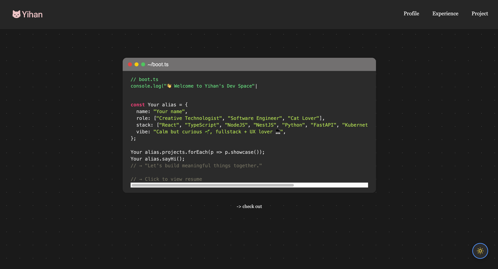

# 🌱 Your Next Portfolio Template

Welcome to your next **easy-build** portfolio site – crafted with React and designed to help developers share their journey with style and simplicity.

🖥 **Live Demo:** [https://yihan.earth/](https://yihan.earth/)

---

## ✨ Why You'll Love This Template

- ⚡ **Super Easy to Customize** – Just update a single file!
- 🌓 **Light & Dark Themes** – Two clean, modern color schemes to choose from.
- 📅 **Experience Timeline** – Showcase your personal or professional journey in a beautiful format.
- 📱 **Fully Responsive** – Mobile-friendly and accessible.

---

## 🖼 Preview




---

## 🚀 Quick Start Guide

Follow these simple steps to launch your portfolio locally:

```bash
# 1. Clone the repository
git clone https://github.com/your-username/your-repo-name.git

# 2. Install dependencies
npm install

# 3. Run the development server
npm run dev
```


## 🔧 Customize Your Portfolio

This template is designed to be incredibly easy to personalize. Here's what you need to do:

### 📝 Edit Your Information

Open the file: src/data.ts

And update the content:

- Profile  
- Intro and bio  
- Experience timeline  
- Projects  
- Social links and more

---

## 🌐 Deployment

Once your portfolio is customized, you can deploy it for the world to see.

### ✅ Vercel

1. Push your code to GitHub  
2. Go to [vercel.com](https://vercel.com)  
3. Import the project and follow the setup steps

### ✅ Netlify

1. Push your code to GitHub  
2. Go to [netlify.com](https://www.netlify.com)  
3. Link your repository and deploy

### ✅ AWS Amplify

1. Push your code to GitHub  
2. Go to [AWS Amplify Console](https://aws.amazon.com/amplify/)  
3. Connect your repository and follow the setup guide

---

## 🤝 Contributions

Contributions are always welcome! ✨

If you want to make improvements or fix issues:

```bash
# 1. Fork this repository

# 2. Create a new branch
git checkout -b feature/your-feature-name

# 3. Make your changes and commit
git commit -m "Add feature"

# 4. Push to your fork
git push origin feature/your-feature-name

# 5. Open a Pull Request 🚀


## 📄 License
This project is licensed under the MIT License.

If you enjoyed using this template, feel free to star 🌟 the repo and share it with your friends!