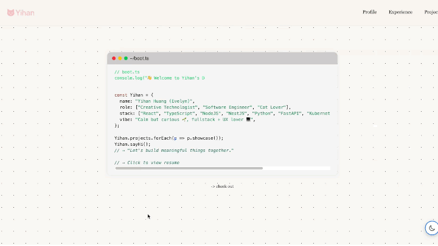

# 🌱 Your Glow Portfolio Template

Welcome to **Glow**, your next **easy-build** portfolio site – crafted with React and designed to help developers share their journey with style and simplicity.

Whether you're showcasing your experience, projects, or personal story, **Glow** gives you a clean, elegant timeline layout with both light and dark modes.

🖥 **Live Demo:** [yihan.earth](https://yihan.earth)

---

## ✨ Why You'll Love This Template

- ⚡ **Super Easy to Customize** – Just update a **single file**!
- 🌓 **Light & Dark Themes** – Two clean, modern color schemes to choose from.
- 📅 **Experience Timeline** – Showcase your personal or professional journey in a beautiful format.
- 📱 **Fully Responsive** – Mobile-friendly and accessible.

---

## 🖼 Preview

### Light Mode Preview


### Dark Mode Preview


---

## 🚀 Quick Start Guide

Follow these simple steps to launch your portfolio locally:

```bash
# 1. Clone the repository
git clone https://github.com/y1hanh/react-portfolio-template.git

# 2. Install dependencies
npm install

# 3. Run the development server
npm run dev
```
---

## Customize Your Portfolio

This template is designed to be incredibly easy to personalize. Here's what you need to do:

### Edit Your Information

Open the file: src/data.ts

And update the content:

- Profile
- Experience timeline  
- Projects

---

## Deployment

Once your portfolio is customized, you can deploy it for the world to see.

### Vercel

1. Push your code to GitHub  
2. Go to [vercel.com](https://vercel.com)  
3. Import the project and follow the setup steps

### AWS Amplify

1. Push your code to GitHub  
2. Go to [AWS Amplify Console](https://aws.amazon.com/amplify/)  
3. Connect your repository and follow the setup guide

---

## Contributions

Contributions are always welcome! ✨

If you want to make improvements or fix issues:

```bash
# 1. Fork this repository

# 2. Create a new branch
git checkout -b feature/your-feature-name

# 3. Make your changes and commit
git commit -m "Add feature"

# 4. Push to your fork
git push origin feature/your-feature-name

# 5. Open a Pull Request 🚀
```

## License
This project is licensed under the MIT License.

If you enjoyed using this template, feel free to star 🌟 the repo and share it with your friends!

## Created by
Made with ❤️ by [Yihan](https://github.com/y1hanh)

If you enjoyed using this template, feel free to star 🌟 the repo and share it with your friends!